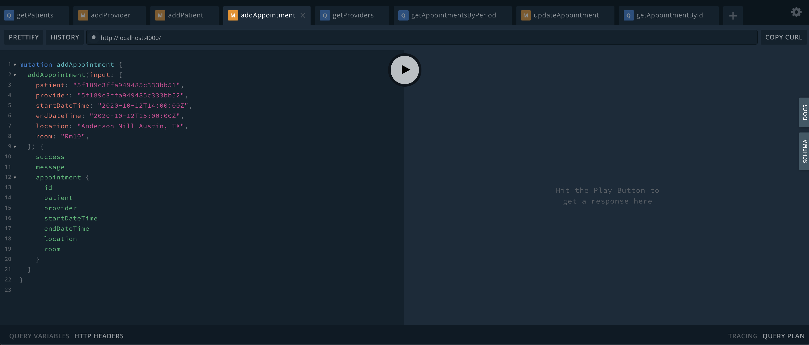
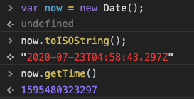
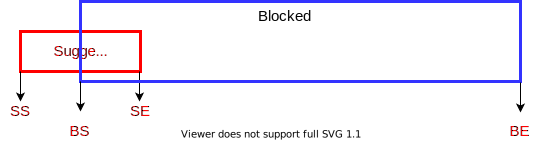
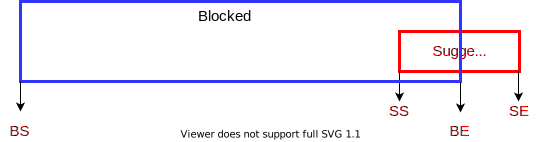
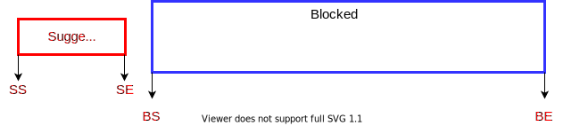
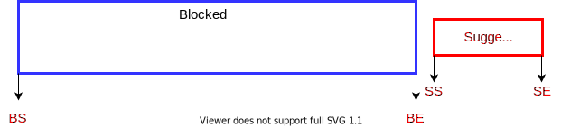

# Medical Appointment Scheduling System

This scheduling system connects patients and medical service providers by creating an appointment during their available hours. Using frontend UI that communicates with a server via GraphQL interface, office administrators can effectively and efficiently fetch patient information, provider information, and appointment information as well as manage these data by creating, updating, and deleting in Mongo DB.

There are three models in this system, `Patient`, `Provider`, and `Appointment`. I tried to reflect the reality of the appointment-making procedures that I've experienced so far as much as possible. The system development scope is limited to the backend part for now, but there will be more considerations and issues that will come up with when we expand the development scope into frontend and cloud infrastructure parts.

## Presentation

[Presentation Slides](https://docs.google.com/presentation/d/1m-oGZXMhRoBaQRV9M0ZayhUJNa2Ju4Xs0-epUA8hJUk/edit?usp=sharing)

## Working Examples

When you enter the example sites, Apollo Playground will be shown and you can test your GraphQL queries and mutations. Two example apps are connected to the same Mongo DB source.
(Examples are in `/graphql` folder)

[AWS Elastic Beanstalk](http://schedule.us-east-1.elasticbeanstalk.com/)

[Heroku](https://stan-scheduling-app.herokuapp.com/)

## Installation

This program uses 3rd party npm packages as below:

- apollo-server
- graphql
- graphql-iso-date
- graphql-type-json
- moment
- moment-timezone
- mongoose
- dotenv
- jest
- faker
- ...

To install these npm packages, Node.js should be installed beforehand. 

In Node.js environment, run this command in the project root folder:

```
npm install
```

## Environment Variables

In local test environment, the environment variables are stored in `.env` file. To read this environment variables, `dotenv` npm package has been used [dotenv npm](https://www.npmjs.com/package/dotenv)

Here is the list of the currently used environment variables:

| Env Variable          | Description                                                                                    |
| --------------------- | -----------------------------------------------------------------------------------------------|
| MONGO_DB_REMOTE_URL   | Mongo DB Remote URL for regular use (Current Mongo DB instance is from Mongo Atlas DB)         |
| MONGO_DB_TEST_URL     | Mongo DB Test URL (frequent data deletes during integration test)                              |
| LOG_LEVEL             | (Optional. Default is `info`) `ALL`,`TRACE`,`DEBUG`,`INFO`,`WARN`,`ERROR`,`FATAL`,`MARK`,`OFF` |

The preferred approach to run this Node.js app is to preload the environment variables before running actual app. `npm run start` actually preload the environment variables and run the application.

The reasons why I prefer preloading are:

- Less side effects when you preload the environment variables rather than loading them inside the application
- Simliar to the preloading situation inside cloud infrastructures such as AWS EC2 or Heroku

## Run

To run the GraphQL server, you can run this command

```
> npm run start

> scheduling-system@1.0.0 start /Users/stan/code/scheduling-system
> node -r dotenv/config src/index.js

[Mongo DB] database: scheduling, host: avery.sgwq8.mongodb.net, username: stanlee, port: 27017 (default)
🚀 Scheduling App running at http://localhost:4000/
 ✓ Connected to Mongo DB
```

With the server still running, please visit `http://localhost:4000` in your browser to open GraphQL Playground (Apollo SErver hosts GraphQL Playground automatically when you run it in development). 

If env variable `NODE_ENV` is set to `production`, GraphQL Playground and introspection will be disabled by default.



## Test

To run integration test, you need to set Mongo DB test URL in env variable `MONGO_DB_TEST_URL`. 
For every test, it will wipe out previous records, and run DB operations from there. 

To run the test, you don't need to run the GraphQL server since the test script itself will run the server by itself. Please enter this command:

```
npm run test
```

### GraphQL Queries & Mutations

To query a graphQL server, you can use `Apollo Playground` to run each query or mutation. 

GraphQL query and mutation examples are in `graphql` folder. You can run any of examples to test each query and mutation.


## Log

The log management in this system uses [`log4js`](https://www.npmjs.com/package/log4js) npm package. There are 8 levels in the log

```
ALL < TRACE < DEBUG < INFO < WARN < ERROR < FATAL < MARK < OFF
```
(`OFF` is intended to turn off logging)

You can set the log level by adjust env variable `LOG_LEVEL`. The default log level is `info`

## Issues

Here are some issues that I encountered during the development of this project

### Time Input & Output

There are number of ways to transfer the time object from a user's browser to the web application's server. 

Two efficient ways to transfer those time data into the server without any timezone side effect are as below:



1. `Date.prototype.toISOString()`
   The `toISOString()` method returns a string in simplified extended ISO format (ISO 8601) such as `YYYY-MM-DDTHH:mm:ss.sssZ`. The timezone is always zero UTC offset and it shows by the suffix `Z` at the end of the ISO string format.

   This string can be transferred to the server side and the server app can create a new `Date` object directly from this ISO string to handle Date-related operations.

2. `Date.prototype.getTime()`
   The `getTime()` method returns the number of milliseconds since the Unix Epoch. Originally it started from Unix Timestamp which tracks time as a total running of seconds at the Unix Epoch on January 1st, 1970 at UTC. This count does not change no matter where you are located on the globe. This is very useful to computer systems for tracking and sorting dated information on both server and client sides. In JavaScript, this method returns the number of milliseconds instead of the number of seconds.

Below example shows that ISO string and unix timestamp are interchangeable and we can use either of them as a string format or a number format to transfer time information from client to server and vice versa.

   ```
    > const startTime = new Date('2020-07-23T04:58:43.297Z');
    > startTime
    2020-07-23T04:58:43.297Z
    > startTime.getTime()
    1595480323297
    > const sameTime = new Date(1595480323297);
    > sameTime
    2020-07-23T04:58:43.297Z
   ```

For now, I use `ISO String` format to transfer time data from client to the server.

### Time zone

For scheduling app like this, time zone issue is quite sensitive one since it can bring a huge amount of confusion between patients and providers. 

For example, a patient traveling in California plans to go back to his home city, Austin, next week. He wants to make an appointment at 1:00PM next Thursday. He found an available spot in the scheduling app, and takes that spot to make his appointment with a doctor. However, the app developer made a mistake to interpret time zone. He designed to get the current time based on the time zone where the user web broswer is used. In this case, the patient made an appointment with a doctor in Texas at 1PM, but this 1PM is Pacific Daylight Time(PDT), instead of Central Daylight Time(CDT). He remembered that the appointment was at 1PM, but next Thursday he might find that the appointment is actually 3PM in Austin. 

There are many questions around the issue of how to determine time zone. In my opinion, I believe the time zone should be based on the provider's location. All the visitors who wants to meet a specific medical service provider need to visit the provider's office and check the provider's time zone to visit at the right time.

In the above example, even though the patient is in California, if the patient visit a provider in Texas in the future, the browser should show a schedule sheet or calendar based on the provider's time zone. If the appointment was set to 3PM, then it means 3PM at the time zone of the provider. This clarification will make all the scheduling between patients and providers much easier.

UTC(Coordinated Univeral Time) is a time standard that is the basis for civil time and time zones worldwide. Depending on geographical location, time zone changes and we can calculate time zone offset, the difference between UTC and local time in minutes. We can calculate time zone offset using `getTimezoneOffset()` in JavaScript. 

```
> var now = new Date()
> now.getTimezoneOffset()
300
> now.toISOString()
'2020-07-23T06:01:45.015Z'
```

This means the current time zone is 300 minutes (5 hrs) behind UTC. UTC time is `06:01:45Z` and the current time (in Austin) is `01:01:45`.  But using an offset to calculate timezone is a wrong approach since time zones and daylight saving rules can change on several occasions during a year and it's very hard to track down all the changes. 

JavaScript Standard object `Date` has poor support on time zone transition. [`moment-timezone`](https://momentjs.com/timezone/) npm package has better support in parsing and displaying dates and times in any time zones. If we know the current time zone and UTC time, then we can get local time using this npm package. 

To get a timezone of a user's browser, you can run this:

```
> Intl.DateTimeFormat().resolvedOptions().timeZone
"America/Chicago"
```

With this time zone information and `moment-timezone` npm package, you can get a local time:

```
> var now = new Date();
> now.toISOString()
'2020-07-23T06:19:38.520Z'
> moment(now).tz('America/Chicago').format()
'2020-07-23T01:19:38-05:00'
```

### Provider's Schedule Availability

Before making an appointment between a patient and a provider, we need to check the provider's current situation. 

The provider might have these schedules:

- Blocked schedules: Due to PTO or vacation, the provider might block some period of dates so that no patient can make an appointment on those dates or during specific time period.
- Regular hours: Every provider has a specific planned business hours so that patients can make an appointment to meet the doctors. Those are mostly based on the day of the week such as Monday 9am-5pm. 
- Available schedule: For some reason, a provider can shift their schedules for specific days or period. For example, for a specific provider, the regular hours can be MWF 9am-5pm. But from 10/1~10/30, it can be MTTh 8am-4pm. In this case, this available schedules have higher priority than the regular hours so that patients can make appointments during this available hours. 

In the scheduling app, the algorithm to determine whether a patient can make an appointment should pass these four conditions:

1. The suggested appointment should not overlap with any of blocked schedules.
2. If the suggested appointment is within the dates of the availables schedules,
   1. Check whether the suggested appointment is contained in the available schedules. If it's contained, then we will need to jump to [Step 4] to check any overlap with the existing appointments
3. If the suggested appointment is outside of the dates of the available schedules, we need to check regular hours
4. Check with the provider's existing schedules to see if there is any overlap

### Schedule Overlap & Containment Condition

To determine whether two schedules are overlapping, containing one another, or entirely separate is very important to check whether a patient can make an appointment with a provider. 

For example, let's check the mathematical conditions for overlapping situation between blocked schedule and suggested schedule.

For each schedule, we will get numbers that represent Unix timestamp in milliseconds for each starting point and ending point of each period. Each timestamp represents below:

| Abbreviation   | Description                                          |
| ---------------| -----------------------------------------------------|
| SS             | Suggested schedule's starting point Unix timestamp   |
| SE             | Suggested schedule's ending point Unix timestamp     |
| BS             | Blocked schedule's starting point Unix timestamp     |
| BE             | Blocked schedule's ending point Unix timestamp       |

* Case 1: Overlap at the left edge



Condition: `SS<BS<SE`

<br>

* Case 2: Overlap at the right edge



Condition: `SS<BE<SE`

<br>

* Case 3: Containment


Condition: `BS<=SS && SE<=BE`

<br>

* Case 4: Entirely separated on the left



Condition: `SS<SE< BS`

<br>

* Case 5: Entirely seprated on the right



Condition: `BE<SS<SE`

<br>

We will check the endpoint conditions and determine its overlap status.

## Future work

- Patient & Providers pagination: If the number of patients and providers are quite big, then we need to use pagination to fetch those lists with limited sizes repeatedly
- Adding Patients and Providers into AWS Cognito account: userName will the key to match Cognito user and DB patient and providers
  
## References

[Using the Elastic Beanstalk Node.js platform](https://docs.aws.amazon.com/elasticbeanstalk/latest/dg/create_deploy_nodejs.container.html)

[Develop & Deploy a Node.js App to AWS Elastic Beanstalk & MongoDB Atlas](https://www.mongodb.com/blog/post/develop-and-deploy-a-nodejs-app-to-aws-elastic-beanstalk-and-mongodb-atlas)

[Using Mongo DB Atlas with AWS ElasticBeanstalk](https://medium.com/@faridhajnal14/using-mongo-db-atlas-with-aws-elasticbeanstalk-5e97d2340453)

[AWS Elastic Beanstalk: Create an application source bundle](https://www.mongodb.com/blog/post/develop-and-deploy-a-nodejs-app-to-aws-elastic-beanstalk-and-mongodb-atlas)

[Epoch Converter](https://www.epochconverter.com/)

[UTC Time](https://www.utctime.net/)